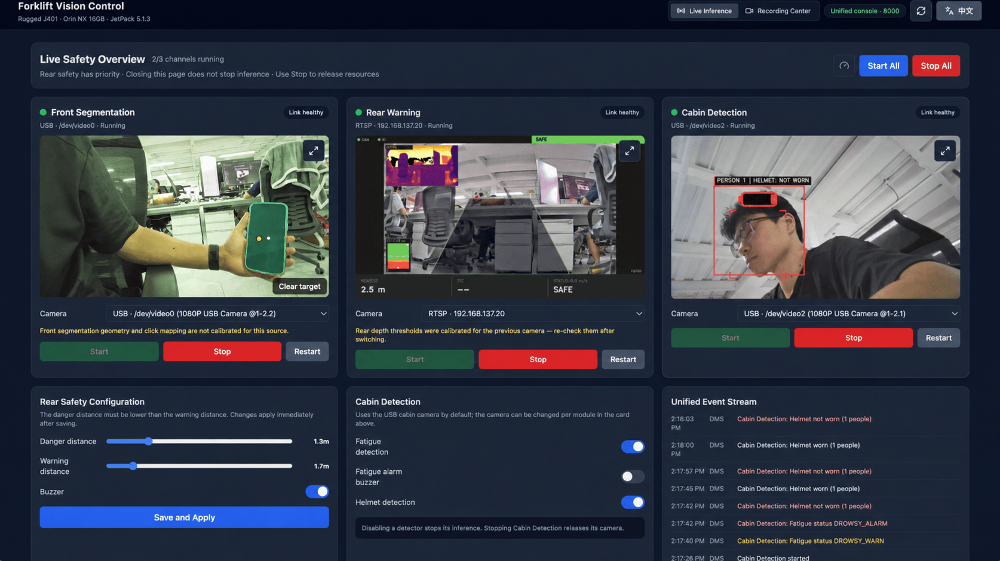

# Rugged J401 三路视觉总控（Visual Hub）

[English](README.md) · **中文**


面向叉车/场内作业车的**三路视觉总控 + 纯录制中心**：前视点击分割、后视单目测距碰撞预警、座舱疲劳与头盔监测，
每个模块各自从总控能检测到的相机里挑自己的那一路，按需启动、可一键释放。设备侧另有一个同页的桌面全屏入口。



*三路总控界面：前视点击分割、带 SAFE/WARNING/DANGER 实时面板的后视深度预警、以及座舱头盔/疲劳检测。每张卡片
都带自己的摄像头选择器，各自绑定到总控检测到的一路相机上——角色之间如何共用硬件见
[给每个模块选择摄像头](#5-给每个模块选择摄像头)。*

| 项目 | 值 |
| --- | --- |
| 设备 | reComputer Rugged J401（Seeed） |
| 计算 | NVIDIA Jetson Orin NX 16GB |
| 系统 | JetPack 5.1.3 / L4T R35.5.0 / Ubuntu 20.04 |
| 运行时 | Python 3.8.10（项目内 `.venv`）、CUDA 11.4、TensorRT 8.5 |
| PyTorch | `2.1.0a0+41361538.nv23.6`（NVIDIA jp5 redist wheel） |
| 相机 | 默认 2× PoE RTSP + 1× USB 1080P；**任何模块都可以在界面上改绑到任意检测到的相机** |

**唯一用户入口：**

```text
http://<Jetson 局域网 IP>:8000/
```

> **安全边界（请先读）**：本系统是**驾驶/操作辅助原型**，不是功能安全系统。它不替代驾驶员观察，
> 不承诺"避免碰撞"，不构成任何安全认证，也不得用于合规判定。感知不可靠时必须显示
> `SYSTEM ERROR`，**绝不默认 SAFE**。详见[安全](#安全)。

## 目录

[系统组成](#系统组成) · [功能一览](#功能一览) · [目录结构](#目录结构) · [安装与部署](#安装与部署) ·
[运行与运维](#运行与运维) · [配置](#配置) · [HTTP API](#http-api) · [日志与保留](#日志与保留) ·
[测试](#测试) · [故障排查](#故障排查) · [安全](#安全) · [备份与恢复](#备份与恢复) · [文档](#文档)

## 快速开始

```bash
cd /home/seeed/workspace/seg_demo

sudo ./deploy/install.sh          # 一次性：systemd 单元 / logrotate / 免密 sudo / 桌面图标
sudo systemctl start visual-hub   # 启动总控（开机已 enabled）
# 浏览器打开 http://<Jetson IP>:8000/ → 点"一键全开"

./scripts/run_visual_hub.sh stop  # 停录制 + 停三路推理 + 释放相机/显存/端口
./scripts/run_visual_hub.sh status
```

## 系统组成

| 模块 | 相机 | 进程模型 | 端口 | 能力 |
| --- | --- | --- | --- | --- |
| **前视分割** `front` | `FRONT_CAMERA_URL`（PoE RTSP）· 可改绑 | 主进程内 | 公开 **8000** | EfficientTAM 点击分割 + 记忆跟踪 + 目标重现自动重锁 |
| **后视预警** `rear` | `REAR_CAMERA_URL`（PoE RTSP）· 可改绑 | 子进程 `app/warn_app.py` | 回环 **8080** | 单目度量深度 + 障碍/人体双通道 + SAFE/WARNING/DANGER/SYSTEM_ERROR |
| **座舱监测** `dms` | `DMS_CAMERA`（默认 `usb:0`）· 可改绑 | 子进程 `app/dms_app.py` | 回环 **8010** | MediaPipe 面部疲劳 + 头盔佩戴三值判定，两路可独立开关 |

「相机」这一列是**默认值，不是限制**：每个模块都能在自己的卡片里改绑到任意检测到的相机，选择会被持久化
（见[给每个模块选择摄像头](#5-给每个模块选择摄像头)）。默认值来自受保护的环境文件；没有相机的模块只会在自己的
启动请求上报错，不会把整个总控一起拖down。

总控本身负责：**相机独占租约**（同一物理设备只允许一个模块持有）、子进程托管与重启、三色灯串口仲裁
（后视 DANGER 优先于座舱疲劳）、热管理降频（88 °C 降档 / 89 °C 暂停头盔并降前视 / 85 °C 以下保持 30 s 再恢复）、
事件总线（内存 500 条环形 + `logs/hub_events.jsonl`）、录制运行时与 MJPEG 代理。

启动时三路**均为空闲**：不占相机、不加载模型、不占显存。相机角色不按发现顺序互换——每个模块只用操作者绑给它的那一路。

## 功能一览

- **一键全开 / 停止全部**：按后视 → 前视 → 座舱启动；停止按座舱 → 前视 → 后视，逐路释放相机、模型、CUDA 与子进程。
- **逐模块选相机**：每张卡片列出检测到的相机（PoE RTSP、USB 节点、手工填源），并显示可达性与当前持有者；
  选择会被持久化，全程不需要 `sudo`、不需要重启，详见[给每个模块选择摄像头](#5-给每个模块选择摄像头)。
  单路失败不会连带关闭已运行的后视。
- **前视交互**：左键选中/细化、右键排除、"清除目标"重选；目标长期丢失后按外观模板验证重锁，换目标会被拒。
- **后视预警**：危险距离必须小于警告距离（UI 强约束）；蜂鸣器开关与服务端值同步；配置持久化后立即生效。
- **座舱监测**：疲劳、头盔两个开关；关闭即真正停止对应推理（不空转、不写误导日志）。
- **显示级全屏**：任一路画面右上角全屏，`Esc` 或返回图标回到总控；浏览器拒绝全屏时自动降级为页内大画面，切换不重启推理。
- **纯录制中心**：顶栏切换，进入前先停全部推理，再按路或一键录制。
- **中英文切换**：顶栏切换，标签页标题同步。
- **Jetson 桌面 GUI**：双击桌面"Visual Hub 总控"打开同一套页面的 Firefox kiosk，带单实例锁与按需拉起服务。

## 目录结构

```text
seg_demo/
├── app/                相机子运行时
│   ├── camera_source.py    统一视频源（usb:/rtsp:/video:/image:/synthetic）
│   ├── web_stream.py       后视/座舱共用的零依赖 MJPEG 服务
│   ├── warn_app.py         后视预警入口（子进程）
│   ├── dms_app.py          座舱监测入口（子进程）
│   ├── warning/            后视：深度后端/滤波/ROI/障碍/时序/风险机/渲染/告警/留存
│   ├── dms/                座舱：相机/疲劳/头盔/PPE/状态/渲染/web
│   ├── geometry/           相机模型、地面平面、像素→XYZ 投影
│   └── depth/              Depth-Anything-V2 度量深度估计
├── backend/            Visual Hub 服务端
│   └── app/
│       ├── main.py          FastAPI 装配（system/camera/hub/recording/segment）
│       ├── config.py        预览流与 HTTP 默认值
│       ├── api/             system · camera(仅 MJPEG 源) · hub · recording
│       ├── hub/             占用租约/子进程托管/事件总线/热管理/三色灯/MJPEG 代理
│       │                    + inventory.py（相机检测、不透明 id、凭据脱敏）
│       ├── recording/       录制运行时（GStreamer H.264 → MP4）
│       ├── segment/         点击分割服务 + 内置 EfficientTAM 包装
│       ├── camera/          CameraManager（独占、状态机）
│       └── streaming/       MJPEG 编码器
├── frontend/           React 页面：Hub（三路总控）+ Recording（纯录制中心）
├── configs/            dms.yaml · warning.yaml · _runtime_store.py · _runtime_overrides.yaml(运行时)
│                       _camera_bindings.yaml（逐模块相机选择；按需生成，已 gitignore）
├── deploy/             系统侧安装物（见"安装与部署"）
├── scripts/            仅 1 个脚本 run_visual_hub.sh —— 唯一入口（见下表）
├── tests/              单一测试根：hub/ segment/ dms/ warning/ geometry/ + 顶层用例
├── docs/               现行文档；历史阶段资料在 docs/archive/
├── models/             转换产物：onnx/ tensorrt/ mediapipe/ manifests/
├── checkpoints/        上游权重：EfficientTAM、Depth-Anything-V2、yolov8n
├── third_party/        EfficientTAM 上游检出（git-ignored，但 venv egg-link 指向它，勿删）
└── logs/               运行时输出（见"日志与保留"）
```

**`scripts/` 只保留一个文件**

| 脚本 | 子命令 |
| --- | --- |
| `run_visual_hub.sh` | `start`（默认，systemd `ExecStart` 同一脚本）、`stop [--poe]`、`status`、`gui` |

`gui` 即桌面入口：服务未起时免密 `systemctl start --no-block` 拉起，轮询 `/api/health`，挑选操作者真正能看到的
屏幕（物理屏 / RDP / xpra / SSH X11），再以 Firefox kiosk 全屏打开总控。选屏逻辑已并入这同一个自包含文件。

原来在这里的一次性环境准备、模型/引擎转换、相机标定、`tegrastats` 采样、离线分割与座舱 demo、README 引用自检
都已于 2026-09-20 移除：它们不在运行链路上，且本机已完成部署。需要时可用 `git show HEAD:scripts/<name>` 从本仓库
历史取回（`install_dms_models` 从未提交，只存在于清理前的备份包里）。

## 安装与部署

### 1. 运行环境

运行环境已在本机就绪：`.venv/` 带 Jetson torch/OpenCV 运行时，`third_party/` 是 EfficientTAM 可编辑检出。
激活 venv：

```bash
source .venv/bin/activate
```

一次性环境准备脚本已于 2026-09-20 移除（若需重建 venv，用 `git show HEAD:scripts/<name>` 取回）。它们不会用
PyPI 的 torch 覆盖 Jetson 运行时，也不会替换系统 OpenCV（本机用系统 `python3-opencv 4.5.4`，带 GStreamer）。
JetPack 6 → 5 的完整适配记录在 `docs/archive/MIGRATION.md`。

### 2. 模型与权重

权重与转换后的引擎都已就位（见下表）。产出它们的一次性转换脚本已于 2026-09-20 移除，可用
`git show HEAD:scripts/<name>` 取回。

| 位置 | 内容 |
| --- | --- |
| `checkpoints/` | 上游权重：`efficienttam_ti_512x512.pt`、`depth_anything_v2_metric_indoor_small/`、`yolov8n.pt` |
| `models/onnx/` | 转换中间件：深度、人体、PPE |
| `models/tensorrt/` | 实际推理用 FP16 引擎（**后视/座舱都优先走引擎**） |
| `models/mediapipe/` | `face_landmarker.task` |
| `models/manifests/` | 引擎来源与校验清单 |

### 3. 系统侧安装（`deploy/install.sh`）

仓库可克隆到任意位置；`install.sh` 会把参考部署路径 `/home/seeed/workspace/seg_demo` 与用户 `seeed`
替换成当前 checkout 的实际路径与 `$HUB_USER`：

```bash
git clone https://github.com/zibochen6/rugged_cv_demo.git /home/seeed/workspace/seg_demo
```


> **路径无关**：`visual-hub.service`、`visual-hub.logrotate`、`visual-hub.desktop` 里写的是参考部署
> 路径与用户；`install.sh` 安装时统一改写，因此克隆到别的目录（例如 `/opt/rugged_cv_demo`）也能直接安装。

幂等、可预览、不启停服务、不装软件包：

```bash
sudo ./deploy/install.sh --dry-run     # 预览
sudo ./deploy/install.sh               # 安装/刷新
```

| 安装到 | 来源 | 说明 |
| --- | --- | --- |
| `/etc/systemd/system/visual-hub.service` | `deploy/visual-hub.service` | `User=seeed`、`KillMode=control-group`、`TimeoutStopSec=45`；`EnvironmentFile=-…`（故意设为可选）；仓库路径按当前 checkout 改写 |
| `/etc/systemd/system/poe-pse.service` | `deploy/poe-pse.service` | PoE PSE 电源保持（含排序环说明，**勿加** `After=multi-user.target`） |
| `/etc/systemd/system/poe-cam-net.service` | `deploy/poe-cam-net.service` | 相机网口与子网，常驻 `Type=simple` 链路监视器，网口状态一变就重新配地址 |
| `/usr/local/bin/poe-cam-up.sh` | `deploy/poe-cam-up.sh` | 上面监视器以 `--loop` 运行的脚本；不带参数则只跑一次配置 |
| `/etc/logrotate.d/visual-hub` | `deploy/visual-hub.logrotate` | 按天/20 MB 轮转压缩；日志目录按当前 checkout 改写 |
| `/etc/sudoers.d/seeed-nopasswd` | `deploy/seeed-nopasswd.sudoers` | 安装前 `visudo -c -f` 校验，整体校验失败自动移除 |
| `/etc/seg-demo/visual-hub.env` | `deploy/visual-hub.env.example` | **仅当缺失时**用模板生成，之后不再覆盖 |
| `~/Desktop/visual-hub.desktop` | `deploy/visual-hub.desktop` | 按真实仓库路径重写 `Exec`，并标记 trusted |

### 4. 受保护的环境文件

真实 RTSP 凭据只放 `/etc/seg-demo/visual-hub.env`（`root:root 0600`）。这些值是**出厂默认，不是硬性要求**：
unit 用的是 `EnvironmentFile=-…`，所以完全没有这个文件总控也能起来，之后再把各模块的相机逐个绑上。

| 变量 | 必填 | 说明 |
| --- | --- | --- |
| `FRONT_CAMERA_URL` | — | 前摄 RTSP URL（没有默认值；不设则该模块保持"未配置"） |
| `REAR_CAMERA_URL` | — | 后摄 RTSP URL（没有默认值；旧名 `RTSP_URL` 仍然有效） |
| `DMS_CAMERA` | — | 座舱相机，默认 `usb:0`；`usb:<idx>` / `rtsp://…` / `video:<文件>` / `image:<路径>` / `synthetic` 都接受 |
| `HUB_EXTRA_CAMERAS` | — | 逗号分隔的备用相机 URL，会出现在选择器里，但不必先提升为某个模块的默认值 |
| `HUB_CAMERA_BINDINGS` | — | 逐模块绑定文件路径，默认 `configs/_camera_bindings.yaml` |
| `HUB_PORT` | — | 默认 `8000` |
| `SEG_DEMO_RUNTIME_OVERRIDES` | — | 后视配置持久化路径，默认 `configs/_runtime_overrides.yaml` |
| `VISUAL_HUB_RECORDING_ROOT` | — | 录像根目录，默认 `~/Videos/visual-hub` |
| `FRONT_PORT` / `WEB_PORT` / `DMS_PORT` / `HUB_PYTHON` | — | 端口与解释器覆盖（一般不动） |

网页、公开状态 API、日志与子进程命令行只显示一个不透明 id 加上不含凭据的标签（形如 `RTSP · 192.168.137.20`），
从不回显完整 URL。`tests/hub/test_runtime.py` 断言任何状态响应里都不出现 `rtsp://`。

### 5. 给每个模块选择摄像头

每个模块卡片上都有一个**摄像头**选择器，列出总控真正能看到的相机：

| 类型 | 来源 | 可达性如何判定 |
| --- | --- | --- |
| `rtsp` | `FRONT_CAMERA_URL` / `REAR_CAMERA_URL` / `HUB_EXTRA_CAMERAS` | 对 `host:554` 做有超时的 TCP 连接（结果缓存 10 秒） |
| `usb` | `/sys/class/video4linux` → `usb:<idx>` | `/dev/video<idx>` 是否存在 |
| `file` | 手工填写（`video:<路径>` / `image:<路径>`） | 路径是否存在 |
| `test` | `synthetic`（仅座舱） | 始终可用 |

选择器的行为约定：

- **检测过程绝不打开设备。** `backend/app/hub/inventory.py` 只读 sysfs。去打开一个已被模块持有的相机会失败，
  最坏情况是把句柄抢走，所以那个会逐个打开节点的旧助手 `enumerate_devices()` 是**故意不用**的。
- **凭据不出设备。** API 用不透明的 `sha256(source)[:12]` id 寻址，返回的 `source` 一律脱敏。手工粘贴 RTSP URL
  走 `POST /api/hub/cameras/probe`：只做分类和脱敏，不持久化任何东西。
- **USB 相机：一颗相机只有一个推流节点，而两颗相机往往共用一条总线。** 一个 UVC 相机会在同一个 USB 接口上注册
  多个 V4L2 节点——推流功能（`index` 0）和**根本打不开**的 metadata 功能（`index` 1）——所以清单里只列推流节点
  （`USB · /dev/video2 (1080P USB Camera @1-2.1)`）。其中 `@1-2.1` 是 USB 端口拓扑路径，也是区分两颗**完全一样**的
  相机唯一稳定的依据：廉价 UVC 机型连产品名、厂商、甚至序列号都相同。`/dev/video2` 和 `usb:2` 只是同一颗相机的两种
  写法，两种都接受，并且一律归一化成 `usb:<idx>`。
- **同一路 USB 2.0 总线上挂两颗 USB 相机时无法同时推流。** 在 Rugged J401 上两颗相机都落在同一个 `usb1` hub
  （480 Mbps）上，内核对第二颗直接报 `Not enough bandwidth for altsetting 1`——**任何分辨率都一样**，连 320×240
  都不行。把其中一颗插到 USB 3 口（`usb2`，10 Gbps），或者只让一颗工作。这种情况模块会如实报错
  （`degraded`、`camera_running: false`、`last_error` 有值），而不是挂个绿点显示 0.0 FPS。
- **API 不返回界面文案。** `/api/hub/cameras` 只给结构化字段和不带语言倾向的取值标记
  （`RTSP · 192.168.137.20`、`USB · /dev/video0`、`video · clip.mp4`）。操作者看到的每一个词都由前端用自己的
  翻译表拼出来，所以英文界面不会冒出中文；有测试断言整个响应体不含任何 CJK 字符。
- **改绑正在运行的模块会先停再启。** 相机源只在启动时交给子进程（或主进程内的 `CameraManager`）一次，
  `/api/config` 与 `/api/dms_config` 都无法在运行中改它。界面上会先弹确认。
- **一颗相机只能有一个持有者。** 已被其它模块租用的相机在选择器里置灰并标出持有者；强行请求会被
  `409 CAMERA_BUSY` 拒绝。录制模式下一律拒绝改绑（`409 RECORDING_ACTIVE`），因为录制自己也持有同一批采集句柄。
- **选择会持久化。** 写入 `configs/_camera_bindings.yaml`（权限 `0600`，已 gitignore），由 `seeed` 用户写入，
  全程不需要 `sudo`、不需要重启服务。优先级是**绑定文件 → 环境变量 → 内置默认**；只有与环境默认值**不同**的值
  才算"操作者覆盖"，所以再把出厂相机选回来就会清掉"需重新标定"的提示。
- **删掉这个文件就完全回到从前的行为。** 这就是全部的回滚操作。

两个需要知道的后果：

- **`usb:<idx>` 的编号在重新插拔后不稳定。** id 是源字符串的哈希，所以换到别的编号重新枚举出来的相机会变成
  一条新记录，需要重新选一次（或直接手工填源）。
- **换相机会让标定失效。** 后视距离阈值是按出厂 PoE 相机构标的（`configs/warning.yaml` 的 `camera.intrinsics` /
  `camera_mount`），前视的几何也不是针对别的传感器标定的。只要某个模块绑的不是默认相机，卡片上就会给出提示。

有一件事**不会**被自动发现：接在未知网段上的新 PoE 相机。`deploy/poe-cam-up.sh` 只负责已配置子网的地址供给；
要用它没被告知过的相机，就加进 `HUB_EXTRA_CAMERAS`，或者在选择器里手工填 URL。

## 运行与运维

### 启动 / 停止 / 状态

```bash
sudo systemctl start|stop|restart visual-hub
sudo systemctl status visual-hub
journalctl -u visual-hub -n 200 --no-pager

./scripts/run_visual_hub.sh           # 前台启动（systemd ExecStart 用同一脚本）
./scripts/run_visual_hub.sh stop      # 停录制 → 停三路 → 结束总控 → 校验端口/子进程释放
./scripts/run_visual_hub.sh stop --poe# 再切掉 PoE 供电与子网配置
./scripts/run_visual_hub.sh status    # 只读状态
```

`stop` 幂等、免密，重复执行返回 0 并提示已是停止状态；主路径走
`POST /api/recording/actions/stop-all` → `POST /api/hub/actions/stop-all` → `systemctl stop`，
失败才降级为对总控进程 `SIGTERM`。`--poe` 会断相机电源；`poe-cam-net` 是常驻链路监视器，网口一旦恢复
link 就会立刻重新配好相机子网，不再需要等固定的探测窗口。

手工跑这个脚本前，有两点要知道：

- **端口被占用时，裸跑 `./scripts/run_visual_hub.sh` 会以 exit 3 退出**，这意味着服务本来就在运行。脚本会把
  话说清楚，而不是丢给你一串 uvicorn 的 `[Errno 98] address already in use`。要重启就用
  `sudo systemctl restart visual-hub`；想跑前台就先 `./scripts/run_visual_hub.sh stop`。
- **手工跑看不到 `FRONT_CAMERA_URL` / `REAR_CAMERA_URL`。** `/etc/seg-demo/visual-hub.env` 是
  `root:root 0600`，`seeed` 读不了，只有 systemd 能把它注入进程。所以前台运行会退回到
  `configs/_camera_bindings.yaml`（网页写入的、`seeed` 可读），否则就是完全没有相机启动——脚本会明确说
  这一点，而不是让你以为配置丢了。

### 开机自启

三个 unit 都是 `enabled`。**注意**：`poe-pse.service` 曾写成
`After=multi-user.target`，与自身 `WantedBy=multi-user.target` 构成排序环
（`multi-user.target → visual-hub → poe-pse → multi-user.target`），systemd 的处理方式是
**删除 `visual-hub` 与 `poe-cam-net` 的开机启动任务**——即两者此前从不自启。该行已移除。

已实测（2026-09-19 15:01 重启）：本次启动日志 `ordering cycle` **0 行**，
`visual-hub`/`poe-pse`/`poe-cam-net` 全部自动启动、`/api/health` 正常、三路保持 idle。
`deploy/install.sh` 会在安装时检查该行有没有被重新加回来。

### Jetson 桌面 GUI

连接显示器后双击桌面"Visual Hub 总控"→ 免密拉起服务 → Firefox kiosk 打开同一套页面。
单实例锁保证重复点击只提示；服务未运行时用 `sudo -n systemctl start --no-block` 启动，
随后轮询 `/api/health`（≤300 s），因此慢速启动（加载模型、开相机）不会冻住桌面入口。手工启动：

```bash
./scripts/run_visual_hub.sh gui
```

### 日常操作

- 关闭浏览器不会停止安全功能；需要释放资源必须显式"停止全部"或跑 `stop`。
- 后视配置改动即时生效并写入 `configs/_runtime_overrides.yaml`（`configs/warning.yaml` 永不被覆写）。
- 单路失败先看状态卡片里的 `last_error` 与 `logs/hub_<module>.log`。

## 配置

### 后视 `configs/warning.yaml`

顶层段：`pipeline` `system` `camera`（含 `intrinsics` / `calibrated`）`model` `depth` `camera_mount`
`danger_roi` `collision_corridor` `ground_filter` `obstacle` `distance` `temporal` `ttc` `velocity`
`warning`（危险/警告距离与迟滞）`person`（人体通道与距离阈值）`watchdog` `logger` `events` `io`（报警方式）。

- 状态机 `SAFE → WARNING → DANGER`，进出阈值带迟滞；障碍需连续多帧确认；测距取障碍区域 10% 百分位。
- 相机失联、连续无效深度、推理后端故障 → `SYSTEM ERROR`（fail-visible）。
- `camera.calibrated: false` 时使用 60° 水平 FOV 估算，距离只具备序关系意义；
  真正的内参标定（棋盘格，一次性脚本已于 2026-09-20 移除）结果需手工填入配置。
- 详见 [docs/warning.md](docs/warning.md)。

### 座舱 `configs/dms.yaml`

顶层段：`system` `camera` `runtime` `fatigue` `helmet` `web` `ui` `logger` `notices`。
疲劳与头盔可独立开关，关闭后不加载对应模型、不写误导日志。详见
[docs/dms_helmet_demo.md](docs/dms_helmet_demo.md)（含诚实口径）。

### 运行时覆盖

`configs/_runtime_overrides.yaml` 由网页写入（`_runtime_store.py` 原子替换），只保存用户可见开关，
例如：

```yaml
runtime:
  danger_m: 1.3
  warning_m: 1.7
  buzzer: true
```

`configs/_camera_bindings.yaml` 是另一个运行期文件：由同一套存储、同样的原子写方式生成，但**单独成文件**，
这样总控就不会和子进程去 read-modify-write 同一个文件：

```yaml
cameras:
  dms: usb:0
```

当某个模块指向 PoE 相机时，它里面存的是明文 RTSP URL，所以创建时权限即 `0600`，并且已 gitignore。
删掉它就会回到环境变量默认值。

## 纯录制中心

顶栏切换到 **Recording Center**：进入时先停止全部推理，随后按路或一键录制；只保存原始画面，
不加载模型、不写叠加层、无音频。

- 出流：GStreamer `nvv4l2h264enc` → H.264 MP4，**1920×1080 @ 15 FPS**，单段最长 **30 分钟**。
- 存储：`~/Videos/visual-hub/<camera>/<日期>/`（可用 `VISUAL_HUB_RECORDING_ROOT` 改到大盘）。
- 录制中可实时预览与全屏；关闭网页不会停止录制；写盘用 `.part.mp4` 临时名，正常停止后改名，异常中断的残留会被收尾。
- 录制进行时不能回到推理模式；先"停止全部录制"，再点 "Return to Live Inference"。
- 服务退出会关闭全部录像文件并释放两路 PoE 拉流与 `/dev/video0`。

## HTTP API

`{module_id}` ∈ `front|rear|dms`；`{camera}` 同集合。

| 方法 | 路径 | 说明 |
| --- | --- | --- |
| GET | `/api/health` | 健康检查（前端与 GUI 用它判定服务可用） |
| GET | `/api/system/info` `/api/system/openapi` | 环境与 OpenCV 能力 |
| GET | `/api/hub/status` | 总控全量快照：三路状态/指标、占用、事件、热策略、录制、三色灯 |
| GET | `/api/hub/events` | 事件总线 |
| GET | `/api/hub/modules/{module_id}` | 单路状态 |
| POST | `/api/hub/modules/{module_id}/start` `stop` `restart` | 逐路启停 |
| POST | `/api/hub/actions/start-all` `stop-all` | 一键全开 / 停止全部 |
| POST | `/api/hub/modules/{rear,dms}/config` | 后视距离/蜂鸣器、座舱开关 |
| GET | `/api/hub/cameras` | 检测到的相机（不透明 id + 脱敏源）与各模块当前绑定 |
| POST | `/api/hub/cameras/probe` | 分类并脱敏一个手工填写的源；不持久化任何内容 |
| PUT | `/api/hub/modules/{module_id}/camera` | 把某模块绑定到 `{"camera_id": …}` 或 `{"source": …}`；`?restart=false` 表示下次启动生效 |
| GET | `/api/hub/stream/{module_id}` | 三路 MJPEG（浏览器唯一取流入口） |
| GET | `/api/camera/stream.mjpg` | 前视原始 MJPEG（上一条 front 的源） |
| GET | `/api/segment/status` | 前视分割状态 |
| POST | `/api/segment/start` `stop` `click` `clear` | 分割启停、正/负点选、清除目标 |
| GET | `/api/recording/status` | 录制模式与三路状态、存储余量 |
| POST | `/api/recording/mode/enter` `exit` | 进入/退出录制模式 |
| POST | `/api/recording/cameras/{camera}/start` `stop` | 单路录制 |
| POST | `/api/recording/actions/start-all` `stop-all` | 一键录制 / 停止录制 |
| GET | `/api/recording/stream/{camera}` | 录制预览 |
| GET | `/api/recording/files` | 录像列表 |
| GET | `/api/recording/files/{id}/play` `download` | 播放 / 下载 |

后视配置示例：`{"danger_m": 1.5, "warning_m": 3.0, "buzzer": false}`

## 日志与保留

`logs/` 只放运行时输出，三层保留策略：

| 文件 | 写入方 | 保留 |
| --- | --- | --- |
| `danger_*.jpg` | 后视 DANGER 截图 | 代码内裁剪：最新 200 张且 ≤14 天 |
| `session_*.csv` | 后视逐帧遥测（每次运行一个文件） | 代码内裁剪：最新 40 个且 ≤14 天 |
| `hub_*.log`、`hub_events.jsonl`、`dms_events.jsonl` | 总控/子进程 | logrotate：按天 / 20 MB，压缩保留 7 份 |
| `tegrastats.log` | 手动 `tegrastats` 采样 | 自行管理 |

`logrotate` 缺失时后两类会无界增长，安装后确认：

```bash
command -v logrotate || sudo apt-get install -y logrotate
sudo ./deploy/install.sh
systemctl list-timers | grep logrotate
```

## 测试

```bash
.venv/bin/python -m pytest -q          # 单一测试根 tests/（pytest.ini 已配置）
cd frontend && npm run build
```

当前：**343 passed, 2 skipped**。需要真实硬件的用例统一由 `SEG_DEMO_HARDWARE_TESTS=1` 门控
（默认 skipped，可见不隐藏）：

```bash
SEG_DEMO_HARDWARE_TESTS=1 .venv/bin/python -m pytest -q tests/test_camera_manager.py \
    tests/segment/test_model_load.py
```

本 README 的引用自检脚本（上次运行：72 处引用、0 处未解析）已于 2026-09-20 随其它一次性脚本移除；
若再次大改文档，可用 `git show HEAD:scripts/<name>` 取回。

| 目录 | 覆盖 |
| --- | --- |
| `tests/hub/` | 运行时托管、录制运行时、热管理、三色灯、座舱事件、相机清单与脱敏、逐模块相机绑定（含「状态响应不含 RTSP URL」） |
| `tests/segment/` | 分割服务/状态机/多边形/模板/模型加载（硬件门控） |
| `tests/dms/` | 疲劳信号与状态机、头盔启发式、PPE、渲染/HUD、开关、web 契约 |
| `tests/warning/` | 风险核心、合成场景 gate、人体通道、热降频、留存裁剪 |
| `tests/geometry/` | 相机模型与像素→XYZ 投影 |
| 顶层 | `CameraManager` 生命周期、警告核心、合成场景 |

## 故障排查

| 现象 | 检查 | 处置 |
| --- | --- | --- |
| 双击桌面图标弹密码框 | `/etc/sudoers.d/seeed-nopasswd` 是否存在 | `sudo ./deploy/install.sh` |
| 开机后 8000 不通、服务 inactive | `journalctl -b \| grep "ordering cycle"`、`systemctl is-enabled visual-hub` | `sudo ./deploy/install.sh`（脚本会检查并报告排序环） |
| 某一路报"相机被占用" | `curl -s :8000/api/hub/status` 的 `occupancy` | 先停占用方；USB 用 `fuser -v /dev/video0` |
| 选择器里少了一颗相机 | `curl -s :8000/api/hub/cameras` | 列表是「检测到的 + 当前已绑定的」：把 URL 加进 `HUB_EXTRA_CAMERAS`，或在选择器里手工填写 |
| 逐模块的相机选择存不下来 | `cat configs/_camera_bindings.yaml`、`ls -ld configs/` | 该文件必须对 `seeed` 可写；checkout 不可写时把 `HUB_CAMERA_BINDINGS` 指到可写路径 |
| USB 相机列出来了但模块打不开 | `sudo dmesg \| grep -i "not enough bandwidth"` | 同一路 USB 2.0 总线上挂了两颗 UVC 相机：把其中一颗插到 USB 3 口（`usb2`），或先停掉另一个模块 |
| 选择器显示某相机"无响应" | `ping -I eth1 <相机 IP>`、`curl -s :8000/api/hub/cameras` | 可达性列是真实的 `host:554` TCP 连接；坏掉的 PoE 相机会被如实报出来，而不是藏起来 |
| 前视有画面、后视/座舱无画面 | `ss -ltnp \| grep -E ':8080\|:8010'` | 8080/8010 只回环，必须经 `/api/hub/stream/*` |
| 前视启动后约 8 s 才出画面 | `journalctl -u visual-hub` 里的 model load 行 | 首次加载 EfficientTAM 权重，属预期 |
| 两路 PoE 同时掉线/反复重启 | 共享 PoE 功率预算 | 至少一路改外置 PoE 交换机/注入器（无限 RTSP 重试救不了 brownout） |
| 前视一直卡在 "Connecting to camera…"、CAPTURE 0.0 FPS | `ip -br addr show eth0 eth1 eth2 eth3 eth4`、`ip route get 192.168.137.20`、`journalctl -u poe-cam-net -n 40` | 相机所在的 PoE 口必须同时持有 `192.168.137.100/24`。`poe-cam-net` 只要网口有 link 就会配好地址，网口地址为空说明是链路（线缆/PSE）问题，不是网段配错 |
| PoE 相机能 ping 通，但前视画面冻住（fps 0、frame age 一直涨） | `curl -s :8000/api/hub/modules/front` 里的 `frame_age_s` | 采集守护会在 `SEG_DEMO_RTSP_STALL_TIMEOUT_S`（默认 8 s）后就地重开流；若一直刷 "RTSP reconnect failed"，说明相机本身没有应答 RTSP |
| `*_events.jsonl` 一直变大 | `systemctl list-timers \| grep logrotate` | 装 logrotate 后重跑 `deploy/install.sh` |
| 状态下 `signal_light.last_error` 报串口 `FileNotFoundError` | 是否接了串口三色灯 | 未接属预期；可改 `configs/warning.yaml: io.alarm_mode` |
| 座舱夜间/强逆光不可用 | 是否近红外相机 | 无近红外相机时RGB面部关键点失效，属已知限制 |
| 停止后仍占用相机 | `./scripts/run_visual_hub.sh stop` 输出、`pgrep -af 'warn_app\|dms_app'` | 等 45 s（`TimeoutStopSec`）；仍有残留看 journal |

```bash
curl -s http://127.0.0.1:8000/api/hub/status          # 总控与逐路状态
ss -ltnp | grep -E ':8000|:8010|:8080'                # 只应公开 8000
fuser -v /dev/video0                                  # USB 停止后不应有占用者
ps -ef | grep -E 'warn_app|dms_app|backend.app.main'
tegrastats --interval 5000 >> logs/tegrastats.log     # 手动采样
```

## 安全

**凭据**：真实 RTSP 凭据只在 `/etc/seg-demo/visual-hub.env`（`root:root 0600`），模板见
`deploy/visual-hub.env.example`。不要提交真实凭据；脚本里也不要写 `SUDO_PASS=...` 或
`echo <密码> | sudo -S`。

**免密 sudo**：本机安装了 `deploy/seeed-nopasswd.sudoers` → `/etc/sudoers.d/seeed-nopasswd`，
`seeed` 拥有**完全免密 sudo**（为桌面图标免输密码而按操作方要求启用）。

```bash
sudo rm -f /etc/sudoers.d/seeed-nopasswd      # 卸载（GUI 退回 pkexec 密码框）
```

含义：任何以 `seeed` 身份运行的进程都能无密码取得 root。请把设备限制在可信局域网并控制物理接入；
若 sudoers 写坏，用串口/单用户控制台或 `pkexec visudo` 恢复。

**感知边界（诚实口径）**：

- **后视预警**：单目 RGB 学习式度量深度，在低照度、强反光、透明物体、黑色物体、镜头污染、强振动下会失效。
  仅为驾驶辅助提示；不可靠状态必须 `SYSTEM ERROR`，绝不默认 SAFE。
- **座舱监测**：疲劳 = MediaPipe Face Landmarker + 固定时间规则，**未做** PERCLOS 个体标定；
  头盔 = 人体框→头部 ROI 的颜色/肤色/暗区启发式，按人输出"佩戴/未佩戴/未知"三值，不输出百分比结论。
  两者均为**演示级**，不构成安全认证，不得用于合规判定。
- **前视分割**：交互式跟踪工具（点击选中、负点排除、重现重锁），不是自动目标识别，不产生安全结论。

## 备份与恢复

每次大规模变更前，恢复包保存在项目外：

```text
/home/seeed/workspace/.seg_demo_backups/<时间戳>/
```

包含 Git 状态、tracked 工作树补丁、未跟踪源码压缩包、分阶段删除清单、前后对比报告与 `SHA256SUMS`。
恢复前先停 `visual-hub`，按清单还原；**不要**使用会覆盖当前工作树的强制 reset。

## 文档

现行：

| 文档 | 内容 |
| --- | --- |
| [docs/warning.md](docs/warning.md) | 后视测距预警：状态机、性能、标定、测试 |
| [docs/dms_helmet_demo.md](docs/dms_helmet_demo.md) | 座舱疲劳/头盔：契约、开关语义、诚实口径、验收 |
| [docs/click-segment.md](docs/click-segment.md) | 前视点击分割：接口与用法 |
| [docs/SEGMENT-LESSONS-LEARNED.md](docs/SEGMENT-LESSONS-LEARNED.md) | 目标重现/重锁的排查与检查单 |
| [docs/requirements/visual-hub-gui-fullscreen/](docs/requirements/visual-hub-gui-fullscreen/requirements-contract.md) | 桌面 GUI 与显示级全屏需求契约（frozen） |
| [docs/forklift_scenario_research/](docs/forklift_scenario_research/README.md) | 场景调研（历史快照，路径多为旧结构） |

历史阶段资料（标定工坊、6D 位姿/Marker、3D 点击跟踪、数据集工具、落货放置、双机迁移）在
`docs/archive/`，其中路径与命令大多已失效，仅作追溯。

## 已知限制

- 前视分割首次加载约 7–8 s；单目标跟踪，多目标需清空重选。
- 座舱疲劳无个体标定、无近红外能力；头盔为三态启发式。
- 后视/前视相机共用 Rugged J401 的 PoE 功率预算，同时掉线时优先怀疑供电而非软件。
- `poe-cam-net.service` 是常驻链路监视器而非开机 oneshot：开机后几分钟才拉起的 PoE 相机、或把网线换到另一个
  PoE 口，都能被自动配好地址。探测期间总控照常可用（已解耦，不再排队等待）。
- 前视（PoE RTSP）采集自带守护：OpenCV 的 GStreamer `read()` 在源静默时会一直阻塞，因此改用帧龄判断卡流并
  就地重开流（`SEG_DEMO_RTSP_STALL_TIMEOUT_S` 默认 8 s，`SEG_DEMO_RTSP_RECONNECT_MIN_INTERVAL_S` 默认 2 s）。
- 已发布仓库是单个初始提交（`zibochen6/rugged_cv_demo`）；设备本地工作树仍保留自己的未提交状态，
  日常提交策略请另行决定。
